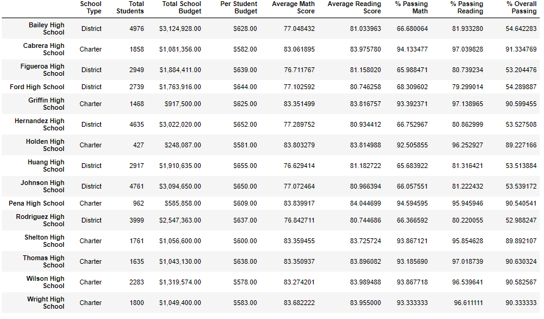

# School_District_Analysis

## Project Overview
The school board has notified us that the file containg all the grades for the differents schools (students_complete.csv) appears to have been corrupted.
Specifically, the reading and math grades for Thomas High School ninth graders appeared to have been changed.
To fix the results, the school board has asked us to:

-Replace all the reading and math scores for the 9th grade students in Thomas High School with "NaN".
-Repeat the school district analysis and recreate the following metrics:
  -The district summary
  -The school summary
  -The top 5 and bottom 5 performing schools, based on the overall passing rate
  -The average math score for each grade level from each school
  -The avearage reading score for each grade level from each school
  -The scores by school spending per student, by school size, and by school type.

## Resources
Data Sources: students.complete.csv, schools.complete.csv
Software: Python 3.7.6, Visual Studio Code 1.53.2

## Summary

The re-analysis of the grades from all the different schools show that
!
 
!

!

!

